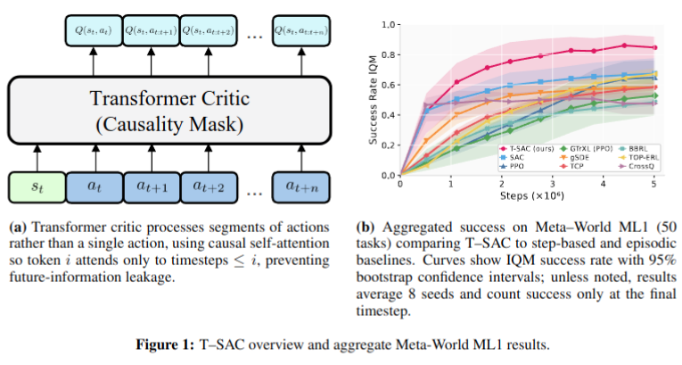
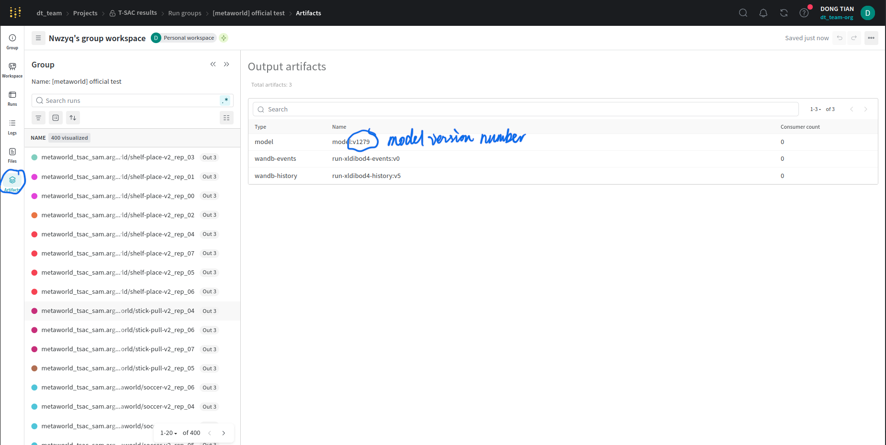
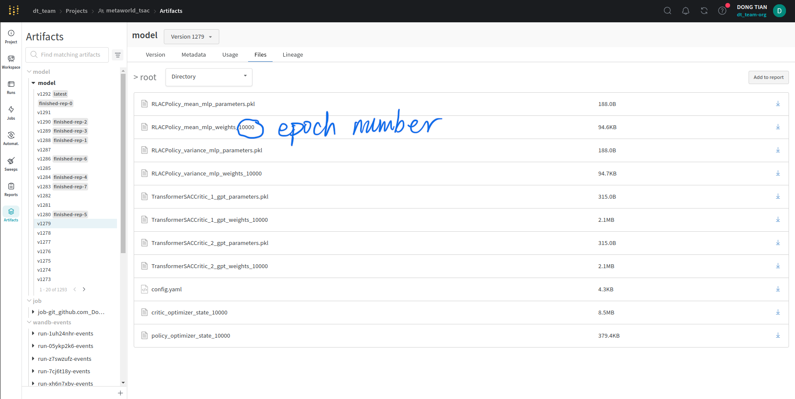

# T-SAC — Chunking the Critic (ICLR 2026)

Official code release for the ICLR 2026 paper:



**Chunking the Critic: A Transformer-Based Soft Actor-Critic with N-Step Returns**  
Dong Tian*, Onur Celik, Gerhard Neumann (Karlsruhe Institute of Technology, KIT)  

\*Corresponding author: dong.tian@outlook.de

openreview: https://openreview.net/forum?id=rb5eTktqbc

arxiv: https://arxiv.org/abs/2503.03660

---

## Note on performance / reproducibility

> The current codebase fully reproduces the results reported in our paper. However, due to compute constraints during development, we were unable to perform extensive rerolling or hyperparameter tuning. We believe this architecture has even higher potential, and our team plans to train and publish a newer, optimized version once additional compute resources become available.

**Public test dashboard (paper runs):**  
https://wandb.ai/dt_team/T-SAC%20results?nw=nwusernwzyq

If you are unable to reproduce the paper or Weights & Biases results **after making a best-effort attempt**, please feel free to open an issue (preferred) or email—we’re happy to help.

---

## TL;DR

T-SAC strengthens SAC by “chunking” **inside the critic**:

- **Transformer critic (causal):** conditions on short state–action windows and predicts **prefix-conditioned** Q-values.
- **Multi-horizon N-step TD (no importance sampling):** trains on variable-horizon N-step targets.
- **Gradient-level averaging:** averages gradients across horizons (instead of averaging targets) to reduce variance without diluting sparse long-horizon signal.
- **Non-soft critic targets:** entropy is handled on the **policy side** (critic learns standard action-values).
- **Optional target-free training:** replace Polyak target updates with a **hard-copy + critic freezing** schedule (single hyperparameter `K`).

---

## What’s in this repo

- T-SAC implementation (actor/critic, losses, replay, training loop)
- Training + evaluation scripts
- Configs for the paper benchmarks
- Scripts for launching multi-seed runs (local / Slurm)

---

## Installation

### Hardware Requirements & CPU-Only Alternative

Linux OS is required. We recommend to use Ubuntu 20.04 here.


We recommend installing PyTorch cu118 to match the cluster environment (HoreKa); nvidia-smi may show CUDA 12.x locally and that is OK.

Running this program requires both a CPU and GPU because **multiprocessing** module is used to distribute the workload: the sampling procedure runs on the CPU, while model training occurs on the GPU.

If a GPU setup is not available, you can run a CPU-only version by doing the following:

1. Execute mp_exp.py instead of mp_exp_multiprocessing.py.

2. In the configuration file located at mprl/config/xxx/transformer_sac_multiprocessing/shared.yaml, change the device setting from "cuda" to "cpu".

⚠️ Reproducibility Warning: All test results reported in our paper were generated using the CPU+GPU setup. Therefore, we cannot guarantee exact reproducibility if you run the experiments using the CPU-only configuration.

### 

---

## Environment setup (Conda required)

### 1) Install Miniconda (recommended)

Download Miniconda for your OS from the official page and install it:

* Miniconda:

      https://www.anaconda.com/docs/getting-started/miniconda/install#macos-linux-installation

* After installation, **close and reopen your terminal** (or start a new shell) so that `conda` is available.

Quick check:

```
conda --version
```

> If `conda` is not found, ensure Miniconda’s install path is on your `PATH`, or run the Miniconda installer again and enable shell initialization.

---

### 2) Switch back to the `base` environment

Before creating the project environment, always return to `base`:

```
conda deactivate 2>/dev/null || true
conda activate base
```

Confirm:

```
echo $CONDA_DEFAULT_ENV
# should print: base
```

---

### 3) Create the project environment using the provided script

From the directory that contains `T-SAC-Official`, run:

```
cd ./T-SAC-Official
bash conda_env.sh
```

> This script creates and configures the environment for the project.

---

### 4) Activate the environment

```
conda activate tsac_official_env
```

Confirm:

```
python --version
echo $CONDA_DEFAULT_ENV
# expected: tsac_official_env
```

---

## Notes

* If you clone dependencies via `git@github.com:...`, you need GitHub SSH keys configured; otherwise use HTTPS clones(not preferred, additional adjustment may be required).

---

## Quickstart

> Replace the commands below with your actual entrypoints (e.g., `python mp_exp_multiprocessing.py .../local.yaml -o --nocodecopy`, 
> `python mp_exp_multiprocessing.py .../horeka.yaml -o -s`).

### Move to execution root of this project
```commandline
cd T-SAC-Official/mprl
```

### Train (local)

```
python mp_exp_multiprocessing.py config/.../transformer_sac_multiprocessing/local.yaml -o --nocodecopy
```
e.g.
```
python mp_exp_multiprocessing.py config/box_push_random_init/transformer_sac_multiprocessing/local.yaml -o --nocodecopy
```
### Train (Horeka)

```
python mp_exp_multiprocessing.py config/.../transformer_sac_multiprocessing/horeka.yaml -o -s
```
e.g.
```
python mp_exp_multiprocessing.py config/box_push_random_init/transformer_sac_multiprocessing/horeka.yaml -o -s
```
### Evaluate (example)

```
python eval.py
```
version number and epoch number will be found at WandB at: 




---

## Reproducing paper results

### Benchmarks

We report results on:

* **Meta-World ML1 (50 tasks)** — success counted **only at the final timestep**
* **Gymnasium MuJoCo v4** — Ant, HalfCheetah, Hopper, Walker2d, HumanoidStandup
* **FANCYGYM Box-Pushing** — Dense + Sparse variants

### Suggested reproduction commands (edit to match your scripts/configs)

### Move to execution root of this project
```commandline
cd T-SAC-Official/mprl
```

#### Meta-World ML1

```
# single task
python mp_exp_multiprocessing.py config/metaworld/transformer_sac_multiprocessing/local.yaml -o --nocodecopy

# sweep all ML1 tasks (Horeka)
python mp_exp_multiprocessing.py config/metaworld/transformer_sac_multiprocessing/horeka.yaml -o -s
```

#### FANCYGYM Box-Pushing Dense

```
python mp_exp_multiprocessing.py config/box_push_random_init/transformer_sac_multiprocessing/local.yaml -o --nocodecopy
python mp_exp_multiprocessing.py config/box_push_random_init/transformer_sac_multiprocessing/horeka.yaml -o -s

```

#### FANCYGYM Box-Pushing Sparse

```
python mp_exp_multiprocessing.py config/box_push_random_init_sparse/transformer_sac_multiprocessing/local.yaml -o --nocodecopy
python mp_exp_multiprocessing.py config/box_push_random_init_sparse/transformer_sac_multiprocessing/horeka.yaml -o -s

```

#### Gymnasium MuJoCo

```
python mp_exp_multiprocessing.py config/gym_mujoco/transformer_sac_multiprocessing/local.yaml -o --nocodecopy
python mp_exp_multiprocessing.py config/gym_mujoco/transformer_sac_multiprocessing/horeka.yaml -o -s
```
---

## Troubleshooting

**Install issues (MuJoCo / rendering):**

* conda-build is essential

When opening an issue, please include:

* command/config used
* git commit hash
* full logs (or W&B link)
* machine + CUDA/driver + package versions

---

## Citation

If you use this code, please cite:

```bibtex
@inproceedings{
tian2026chunking,
title={Chunking the Critic: A Transformer-based Soft Actor-Critic with N-Step Returns},
author={Dong Tian and Onur Celik and Gerhard Neumann},
booktitle={The Fourteenth International Conference on Learning Representations},
year={2026},
url={https://openreview.net/forum?id=rb5eTktqbc}
}
```

---

## License

MIT License (see `LICENSE`).

---

## Contact

* Dong Tian: [dong.tian@outlook.de](mailto:dong.tian@outlook.de)
* Please use GitHub issues for bugs/questions when possible.

[1]: https://github.com/DongTian95/T-SAC-Official/tree/main "GitHub - DongTian95/T-SAC-Official: This is the official release of T-SAC (CHUNKING THE CRITIC: A TRANSFORMER-BASED SOFT ACTOR-CRITIC WITH N-STEP RETURNS, ICLR2026)"
